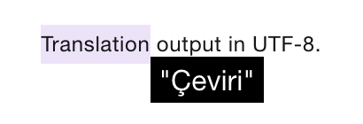

nicemeaning
===========

An experimental translator for Chrome Extension built on IBM Language-Translator Service.

## Installing
* Download this source code
* Write ```chrome://extensions``` down to address bar
* Click to ```Load unpacked``` and select the path which you download this source code.
* Start to use it!


## Usage
* Quite easy to use. Just highlight a word on Chrome, and then press the N letter. That's it! Translated word will be showed up on the same page.


BTW, I left my IBM API key on purpose, so it's ready to use it. No need to bother for creating an account on IBM and API key.

